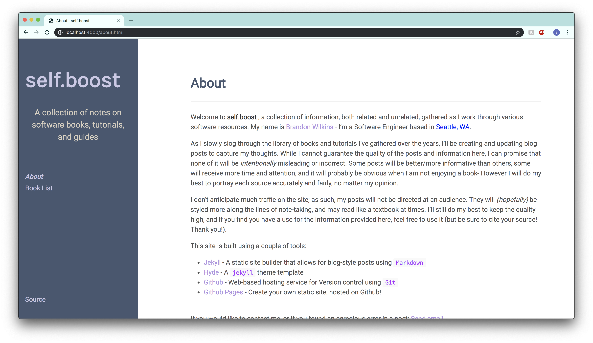

# **self.boost**

Self.boost is a personal blog maintained by [wilkinsb](https://github.com/wilkinsb). The goal of the blog is not to reach many readers, but more to act as an electronic journal of sorts. As I work through various software resources (including but not limited to books, tutorials and guides), I'll use the site to make posts on what I'm learning.

The posts will be grouped according to the resource I'm referencing, with related posts all pointing toward the same resource. This can vary depending on the resource; some posts will be a chapter in a book, others may be an entire tutorial.

As I build more functionality and content into the site, I'll continue to develop this `README.md` with relevent links, pics, etc.

For now, enjoy the (somewhat empty) [site](https://wilkinsb.github.io)!
